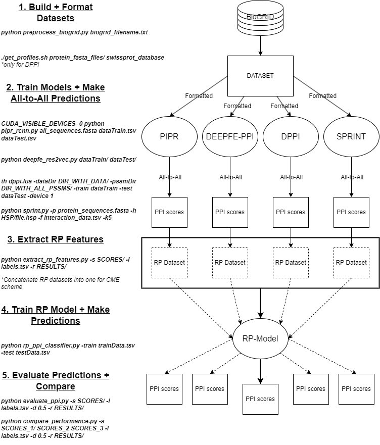

## Bacterial Protein-Protein Interaction Prediction  

Provides implementation for:  
- constructing high-quality PPI datasets  
- running state-of-the-art PPI prediction models  
- evaluating PPI prediction results
  
  
contact: ericarezza@cmail.carleton.ca  
